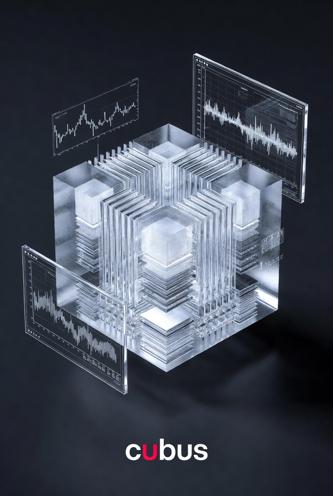

# cubus

**Cognitive Computing in One Binary**

A Rust-native cognitive data cube — XOR delta layers, awareness field scanning, philosopher-recipe thinking styles, and a hyperposition blackboard. All compiled into a single binary with zero external runtime dependencies.

Built on [numrus](https://github.com/cubus1/numrus) for SIMD-accelerated vector operations.

---

## Architecture

```
n8n-rs (policy / autopoiesis)
    ↓ workflow triggers
crewai-rust (agents with philosopher recipes)
    ↓ recipe → threshold vector
cubus (scan + mask + rotate + resonate)
    ↓ Lance append
numrus (AVX-512 XOR / popcount / BF16)
```

## Core Concepts

**XOR Delta Layer** — Ground truth is `&self` forever. Writers get ephemeral deltas. Merge is one XOR. Conflict detection is one AND + popcount. The borrow problem dissolves at the data structure level.

**Awareness Field** — Every record gets a 90° rotated shadow (XOR with fixed rotation key, computed on the fly). Original scan finds what resonates. Rotated scan finds what's orthogonal. Grey matter and white matter as two scans of the same data.

**BF16 Awareness Substrate** — BF16 structured Hamming decomposes XOR diff by bit-field: sign (semantic reversal), exponent (magnitude uncertainty), mantissa (noise). Superposing 2-3 vectors gives per-dimension awareness state: crystallized, tensioned, uncertain, or noise. The cognitive state emerges from the byte layout — no orchestrator needed.

**Thinking Style Recipes** — Not fixed modes but dynamic mixes: analytical, listener, architect, explorer — shifting per source gestalt. Each style is a threshold vector. Inspired by Hegel (dialectic → XOR merge), Kant (categories → frozen mask), Heidegger (Dasein → pure resonance), Schopenhauer (abduction × deduction). Thinking style is detected from BF16 decomposition, not assigned.

**Hyperposition Blackboard** — Agents cast flux into a shared blackboard. Multiple unresolved fluxes coexist as superposition. The superposition IS the awareness — including contradictions and tensions. Written as moment vectors into Lance. The sum of all moments = the awareness horizon. The blackboard memory layout IS the ABI — no serialization, no protocol translation.

**Containers as Packets** — A 1024-byte CogRecord fits in one UDP datagram. Zero serialization. Same binary layout on disk, in memory, and on the wire.

## Workspace

| Crate | Description |
|-------|-------------|
| `cubus` | CogRecord format, 4-channel schema, XOR delta layer |
| `cubus-lance` | Lance/Arrow columnar storage, indexed cascade |
| `cubus-oracle` | Recognition pipeline, Projector64K, capacity sweep |
| `cubus-ghost` | Ghost discovery, pattern classification |

## Related Repositories

| Repo | Description |
|------|-------------|
| [numrus](https://github.com/cubus1/numrus) | SIMD substrate — AVX-512, BF16 Hamming, BLAS, CLAM, NARS |
| [cubus-flow](https://github.com/cubus1/cubus-flow) | Workflow engine — autopoiesis + policy (from n8n-rs) |
| [cubus-agent](https://github.com/cubus1/cubus-agent) | Agent framework — philosopher recipes (from crewai-rust) |
| [cubus-neo4j](https://github.com/cubus1/cubus-neo4j) | Graph-on-Lance with content-addressable CogRecords |

## Performance

| Operation | Speed | Hardware |
|-----------|-------|----------|
| Binary Hamming (8KB / 64Kbit) | 135 ns | AVX-512 VPOPCNTDQ, 57 GiB/s |
| BF16 Structured Hamming (1024-D) | ~12.5 μs | AVX-512 |
| XOR Bind (8KB) | 239 ns | AVX-512, 32 GiB/s |
| LOD+CLAM k-NN (256MB bitplane) | <2 ms | 8,500× vs brute force |
| XOR delta merge | 1 instruction | VPXORQ |
| Conflict detection | 2 instructions | VPANDQ + VPOPCNTQ |
| Lance indexed cascade | 296× bandwidth reduction | columnar scan |
| Projector64K creation (D=1024) | 2267 ms | one-time cost |
| Recognition readout (20 classes) | 21.4 μs | Gram-Schmidt fast path |
| SIMD vs scalar speedup | 24–57× | AVX-512 vs scalar |
| Docker build (Railway) | 70 sec | nightly + AVX-512 |

## Three-Tier Search

| Tier | Method | Speed (10K field) | Output |
|------|--------|-------------------|--------|
| 1 | Binary Hamming scan | 0.2 ms | Rough candidates, 99% pruned |
| 2 | BF16 Structured Hamming | 0.4 ms (top-32) | Reranked + sign/exp/mantissa decomposition |
| 3 | Awareness superposition | ~1.2 μs | Crystallized/tensioned/uncertain/noise per dimension |
| | **Total** | **~0.6 ms** | Richer than GPU cosine, on CPU only |

## Origin

Born from a cognitive architecture that worked in theory but couldn't train — CLIP on 120K images took 50 minutes because Rust had no numpy equivalent. Instead of dropping to Python, we built [numrus](https://github.com/cubus1/numrus). Instead of adding Neo4j, we built graph-on-Lance with content-addressable CogRecords. Instead of adding Redis, we built the XOR delta blackboard. One binary. Zero external services.

55,083 lines of Rust. 1,124 tests. 42 PRs merged. Zero debt.

## License

MIT

---

*Jan Hübener*
